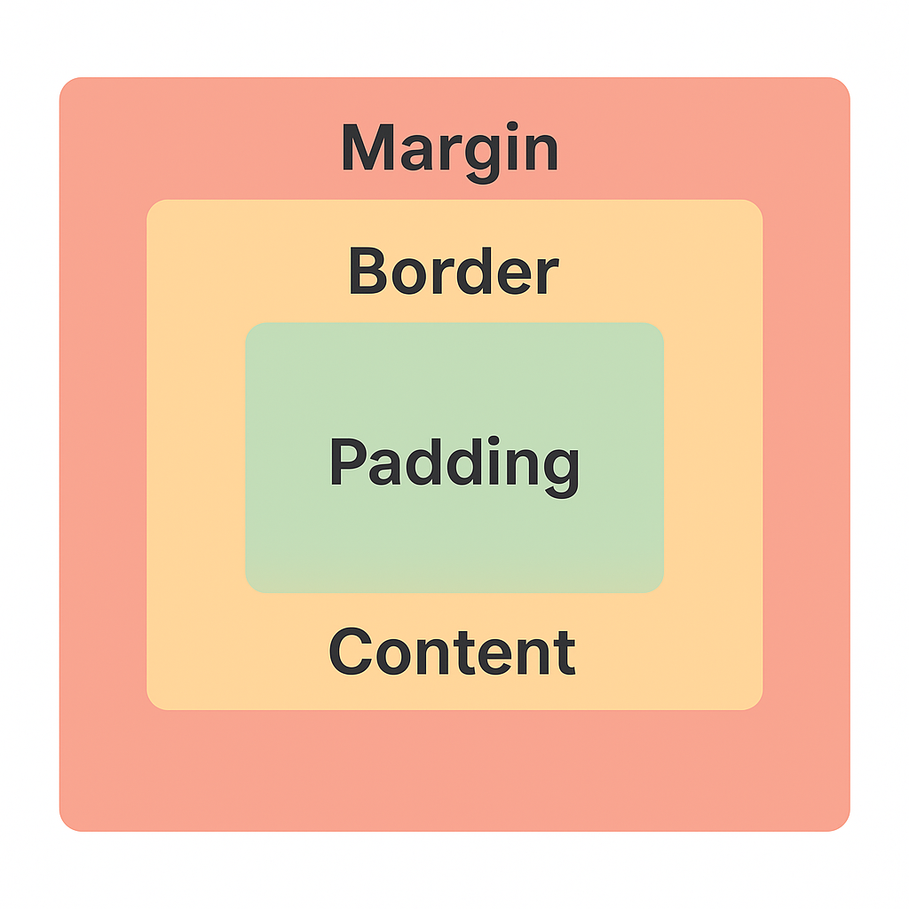

# CSS: Box Label Lab 🏷️

In this exercise, you'll create and label the different layers of the CSS box model: `margin`, `border`, `padding`, and `content`.

This task helps you visualize and understand how these layers are stacked and spaced.

Here a reference image of the box:


## 🧩 Before You Begin: Fork & Clone

To get started, make sure you have your own copy of the project:

- **Fork the Repository:**  
`Go to the project's GitHub page.`
- **Click the Fork button to create your own copy**.
- **Clone Your Fork**:
  `git clone https://github.com/onja-org/w2_box_label_lab.git`
- **cd css-labs/box-model**
- **Open the project** in your code editor and follow the instructions in this lab.

## 💼 Your Task

Start completely from scratch. You'll write both the `HTML` and `CSS` yourself.

In your `index.html`, create a basic structure with nested `<div>` elements:  

- One for margin
- One inside it for border
- One inside that for padding
- And one inside that for content
- Inside each box, include a label like "Margin", "Padding", etc.
- In your `styles.css`, use distinct **background colors** and **spacing** (margin, padding, border) so each layer is visually clear.
- Keep things centered using `flexbox` or `manual centering`.
- Use **Dev Tools** to hover over each layer and confirm your layout is working as expected.

## ✅ Tips

- Use **box-sizing: border-box**; to keep sizing manageable.
- Don't worry about getting it perfect on the first try - use Dev Tools to tweak and debug.
- This is about visual learning - so make it colorful, clear, and creative!

## Bonus Part - Customize Your Box 🎨

Now that you’ve built and labeled each layer of the box model, let’s make it yours!

### ✨ Challenge

Inside your `"Content"` box (innermost layer), add a personal message, your name, or a fun emoji.

You can also add:  

- An image or icon
- A heading and a paragraph
- A creative quote or fact

### 🧠 Why?

Adding content helps you:

- Practice how padding affects spacing around real content
- Understand how borders behave when content grows
- Customize your project to feel more personal and engaging

Feel free to get creative!  This isn’t just about memorizing CSS - it’s about making something!

### Running the Test (Steps)

- Install dependencies by running: `npm install`
- Run the test: `npm test`; This will execute the automated checks and give you feedback on whether your box model structure is correct.

NB: If you encounter errors, read the messages carefully - they’ll help you understand what to fix!

### Submit Your Work

When you're done:

1. Save all changes
2. Make sure all your changes are committed:

    ```
    git add .
    git commit -m "Complete Box Label Lab"
    ```
3. Push your project to GitHub
