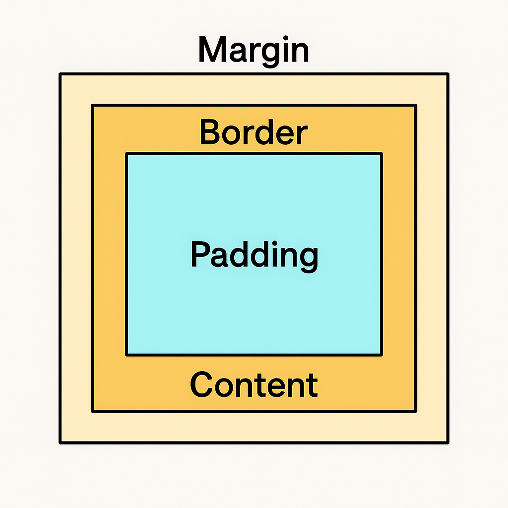

# 📦 Lab : Box Model Basics

**Objective**:  
Understand how the CSS box model works and how each layer (content, padding, border, margin) affects element layout on the page.

## 🛠️ Project Setup  

- git clone [https://github.com/your-username/css-labs.git](https://github.com/onja-org/w2_box_model.git)
- `cd css-labs/box-model`
- Link the `CSS` in your `index.html` head section

    ```html
    <link rel="stylesheet" href="styles.css">
    ```

## 🧠 Part 1: Concept Overview

The Box Model describes how every HTML element is structured in terms of spacing. It is made up of:

- **Content**: The actual content of the box (text, images, etc.).
- **Padding**: Space between the content and the border. It expands the clickable area but doesn’t affect the border.
- **Border**: The line surrounding the padding (and content).
- **Margin**: The space outside the border—used to create space between elements.

Visualize the structure like this:



- **The box-sizing** property changes how total width and height are calculated:
- **content-box** (default): Width = content only. Padding and border are added outside of it.
- **border-box**: Width includes padding and border inside the defined size.

## 🧪 Part 2: Hands-On Task

Create a box that clearly displays each layer:

```html
    <div class="box-model-demo">
    Box Model Demo Content
    </div>
```

## 🕵️‍♀️ Part 3: Explore With Dev Tools

- Right-click the box and inspect it using your `browser’s Dev Tools`.
- Look for the `Box Model panel`. Hover over each part to see it highlighted on the screen.
- Switch between **box-sizing**: `content-box` and `border-box` to compare how the box behaves.

## 📌 Part 4: Summary

- **Padding** pushes the content inward.
- **Border** wraps the padding and content.
- **Margin** pushes other elements away.
- **box-sizing** determines how dimensions are calculated.
