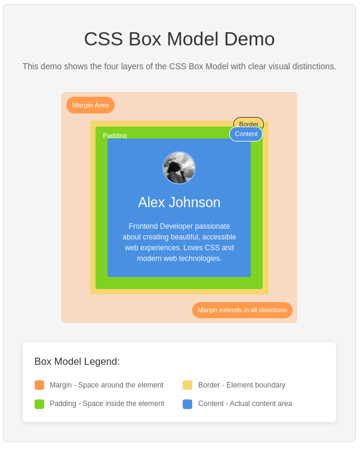

# CSS Box Model Lab

Master the CSS Box Model through hands-on visual demonstration. Build a profile card that clearly shows how margin, border, padding, and content layers work together.

## What You'll Build



A color-coded profile card demonstrating all four CSS Box Model layers with visual labels.

## Understanding the CSS Box Model

Every HTML element is a box with four distinct layers:

### 1. Content (Blue - `#4A90E2`)
**What it is**: The actual content area containing text, images, or other elements.  
**How it works**: This is the innermost layer where your actual content   lives. The content size is determined by `width` and `height` properties.  
**Key behaviors**:
- Contains the element's actual content (text, images, etc.)
- Size controlled by `width` and `height` properties
- Background colors and images appear here
- Text styling (font, color) affects this layer

### 2. Padding (Green - `#7ED321`)
**What it is**: Transparent space between the content and the border.  
**How it works**: Creates breathing room inside the element. Padding increases the element's total size and inherits the background color.  
**Key behaviors**:
- Always transparent but shows the element's background
- Increases the clickable area of elements
- Cannot have negative values
- Individual control: `padding-top`, `padding-right`, `padding-bottom`, `padding-left`

### 3. Border (Yellow - `#F5D76E`)
**What it is**: The visible edge/boundary around the padding and content.  
**How it works**: Can have color, style (solid, dashed, dotted), and width. Forms the visual boundary of your element.  
**Key behaviors**:
- Only layer that's always visible when set
- Has three sub-properties: width, style, color
- Can be styled individually per side
- Affects layout and total element size

### 4. Margin (Orange - `#ff9a4d`)
**What it is**: Transparent space outside the border that separates elements.  
**How it works**: Creates space between elements. Margins can collapse (combine) with adjacent margins.  
**Key behaviors**:
- Always transparent (no background)
- Can have negative values to overlap elements
- Vertical margins collapse between adjacent elements
- Used for spacing and layout positioning

## Lab Activities

Complete these tasks in order to build your understanding:

### Activity 1: HTML Structure Setup
Build the basic HTML framework for your box model demonstration.

**Tasks:**
- [ ] Create semantic HTML5 document structure
- [ ] Add a main card container for the profile
- [ ] Include profile content: image, heading (h2), and paragraph
- [ ] Add placeholder divs for visual labels

### Activity 2: CSS Foundation & Content Layer
Implement the content area (blue) and basic styling.

**Tasks:**
- [ ] Set universal `box-sizing: border-box`
- [ ] Style the content area with blue background (`#4A90E2`)
- [ ] Add flexbox centering to center the card on page
- [ ] Apply basic typography and colors

### Activity 3: Padding Layer Implementation
Add the padding layer (green) around your content.

**Tasks:**
- [ ] Apply 30px padding to the main card
- [ ] Create a visual label for the padding area
- [ ] Position the padding label correctly
- [ ] Observe how padding affects element size

### Activity 4: Border Layer Implementation
Add the border layer (yellow) around padding and content.

**Tasks:**
- [ ] Apply 12px solid yellow border (`#F5D76E`)
- [ ] Create and position a border label
- [ ] Test different border styles (solid, dashed, dotted)
- [ ] Notice how border affects total element dimensions

### Activity 5: Margin Layer Implementation
Add the margin layer (orange) to create space around the entire element.

**Tasks:**
- [ ] Apply 40px margin to create orange space (`#ff9a4d`)
- [ ] Create and position a margin label
- [ ] Test negative margins to see overlapping effects
- [ ] Understand margin collapse behavior

### Activity 6: Visual Labels & Legend
Complete the educational visualization with clear labels.

**Tasks:**
- [ ] Position all four layer labels using absolute positioning
- [ ] Create a color legend explaining each layer
- [ ] Ensure labels are readable on all devices
- [ ] Test label positioning on different screen sizes

### Activity 7: Responsive Design
Make your demonstration work on all devices.

**Tasks:**
- [ ] Add mobile-first media queries
- [ ] Adjust sizes for smaller screens
- [ ] Ensure all labels remain visible
- [ ] Test on multiple device sizes

## Quick Reference Guide

### Essential CSS Properties

```css
/* Content Layer */
.main-card {
    background-color: #4A90E2;  /* Blue content area */
    width: 300px;               /* Content width */
    text-align: center;         /* Center content */
}

/* Padding Layer */
.main-card {
    padding: 30px;              /* Green space inside */
}

/* Border Layer */
.main-card {
    border: 12px solid #F5D76E; /* Yellow boundary */
}

/* Margin Layer */
.main-card {
    margin: 40px;               /* Orange space outside */
}

/* Essential Setup */
* { box-sizing: border-box; }
body { 
    display: flex; 
    justify-content: center; 
    align-items: center; 
    min-height: 100vh; 
}
```

### Visual Labels Template

```css
.label {
    position: absolute;
    padding: 6px 10px;
    border-radius: 12px;
    font-weight: bold;
    font-size: 0.8rem;
    color: white;
}

.margin-label { background: #ff9a4d; top: 5px; right: 5px; }
.border-label { background: #F5D76E; top: 45px; right: 15px; }
.padding-label { background: #7ED321; top: 65px; right: 25px; }
.content-label { background: #4A90E2; top: 85px; right: 35px; }
```

## Testing Your Work

```bash
npm install && npm test
```

Tests verify: HTML structure, CSS properties, box model implementation, and responsive design.

**Debug with Browser Dev Tools:**
1. Right-click → Inspect any element
2. View the computed box model in Elements tab
3. Test responsive design with device toolbar

## Common Issues

**Colors not showing?** → Check CSS selectors and file linking
**Layout problems?** → Verify `box-sizing: border-box` and flexbox setup  
**Labels misaligned?** → Review `position: absolute` and parent positioning
**Mobile issues?** → Test media queries and viewport meta tag

## Success Criteria

**Must Have:** All four color layers visible, proper HTML structure, responsive design
**Should Have:** Clean code, good typography, accessible contrast
**Could Have:** Hover effects, custom styling, additional features

## Need Help?

1. Read test output for specific hints
2. Compare your result with the preview image  
3. Use Dev Tools to inspect styles
4. Check the solution branch: `git checkout solution`

---

**Focus on understanding each layer rather than perfect styling. Experiment and observe how each property affects the layout!**