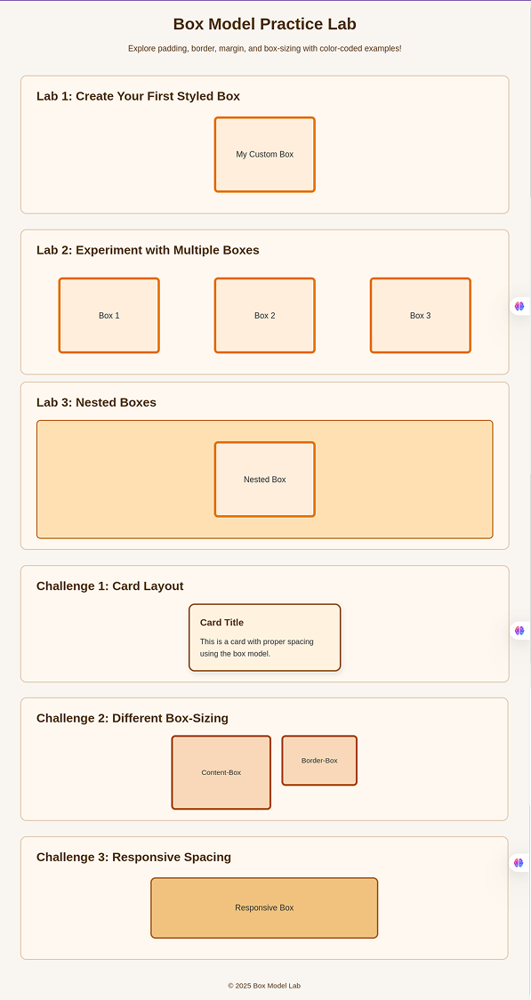

# 📦 Box Model Basics - Lesson

**Objective**:  
Understand how the CSS box model works and how each layer (content, padding, border, margin) affects element layout on the page.

---

## 📖 Conceptual Understanding

### What is the Box Model?

The Box Model describes how every HTML element is structured in terms of spacing.
👉 Every part of a website is a box and those boxes are inside other boxes. This is how web pages are built.

For example:

- The whole page is **a big box** 📦.
- Inside that **box**, you have **smaller boxes** like the *header*, *main content*, and *footer*.
- Inside the *main content*, there are more boxes for `text, images, and buttons.`

Visualize the structure like this:



### Why This Is Important?

Once you understand that everything is a box, it becomes much easier to:

- Organize your content
- Add space between things
- Control how things look on the page

You'll use **CSS** to style each box:

- **Content**: The actual content of the box (text, images, etc.)
- **Padding** adds space inside a box (around the content)
- **Margin** adds space outside a box (between boxes)
- **Border** is the line around a box
- **box-sizing** helps control how big the box is

### Example Structure

Here's how a simple page might look in HTML:

**HTML**  

```html
<body>
  <header>My Website</header>
  <main>
    <section>
      <h1>Welcome!</h1>
      <p>This is my website.</p>
    </section>
  </main>
  <footer>© 2025</footer>
</body>
```

👉 Note that each tag (`<header>`, `<main>`, `<section>`, `<footer>`) is a box.

**CSS**  

```css 
header, main, footer {
  padding: 20px;
  margin: 10px;
  border: 1px solid black;
}
```

### The Four Layers Explained

1. **Content**: The innermost area containing text, images, or other elements
2. **Padding**: Space between the content and the border (transparent)
3. **Border**: A line that wraps around the padding and content
4. **Margin**: Space outside the border, between this element and others (transparent)

### Box-Sizing Property

The `box-sizing` property controls how the total width and height are calculated:

- `content-box` (default): Width/height applies only to content area
- `border-box`: Width/height includes padding and border

---

## 🚀 Ready for Practice?

Now that you understand the theory, it's time for hands-on practice!

**[Start the Lab Activities →](../lab/README.md)**

---

## 📝 Key Takeaways

- Every HTML element is a rectangular box
- The box model has four layers: content, padding, border, margin
- CSS properties control each layer's appearance and spacing
- `box-sizing` affects how dimensions are calculated
- Understanding the box model is fundamental to CSS layout

---

**[← Back to Overview](../README.md) | [Go to Labs →](../lab/README.md)**